# 핸즈온 준비 단계 입니다. (Hands-on Prerequisite)

# 1. 이벤트 엔진 접속 (Event Engine Access)
- **이벤트 엔진으로 접속이 아닐시에는 "2. SageMaker 노트북 생성 (Create SageMaker Notebook)" 에서 시작 해주세요.**
- 이벤트 엔진(https://dashboard.eventengine.run)에 접속을 하시고, 받으신 해시 코드를 입력해주세요. (Connect to the event engine and enter the hashcode given)

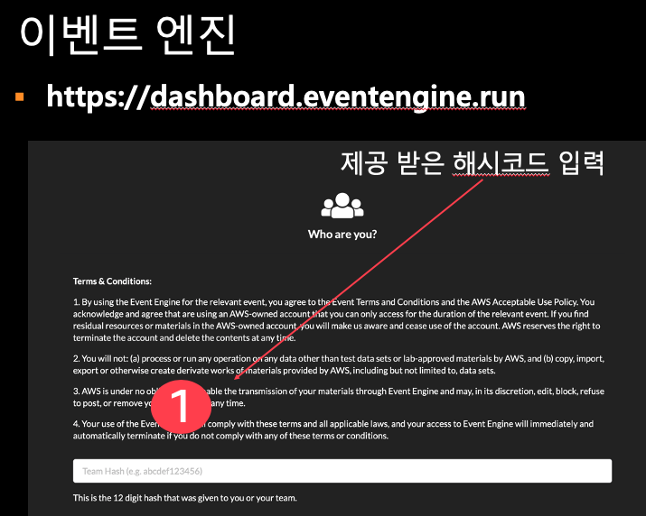

- 로그인 이후에 아래 "AWS Console"을 클릭 합니다. (Click AWS Console)
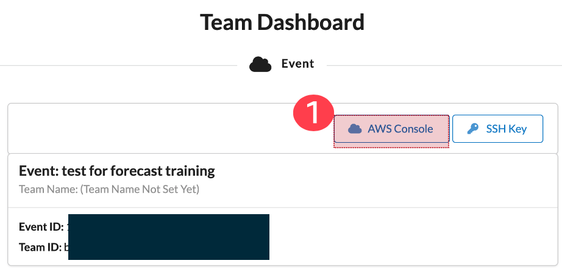

- AWS Console Login 이후에 "Open AWS Console"을 클릭 하세요. (Click "Open AWSConsole")
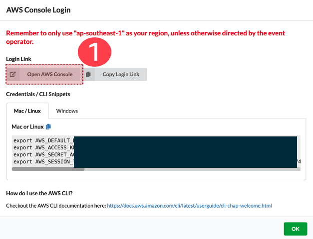

# 2. SageMaker 노트북 생성 (Create SageMaker Notebook)

- SageMaker Console로 이동 하세요. 아래와 같이 "Services"를 클릭하고, 이후에 Sage 입력하면 아래에 Amazon SageMaker가 보입니다. 이를 클릭 해주세요. (Go to sagemaker console, click Services, then type SageMaker, finally click SageMaker below)

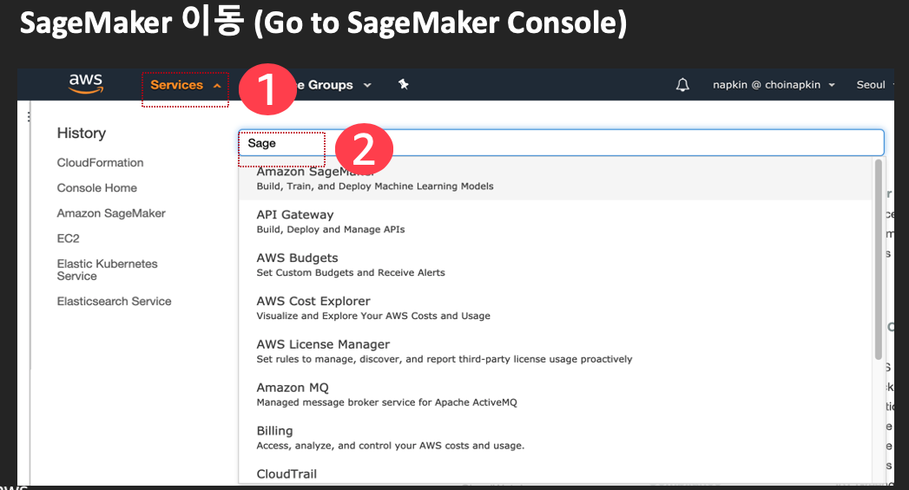

- 노트북 인스턴스를 생성 합니다. 아래와 같이 (1) Notebook Instance를 클릭 합니다. (2) 오른족에 "Create Notebook Instance"를 클릭 합니다. (Click (1) Notebook Instance and then do (2) Create Notebook Instance) 

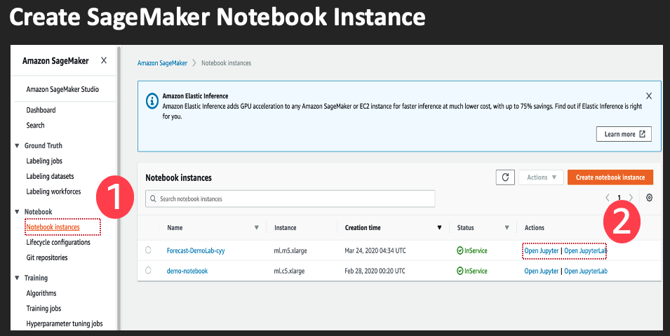

- 노트북의 설정 정보를 입력 합니다. (1) 노트북 이름을 적어 주세요. (예: Forecast-HongGilDong) (2) Permission and encryption에서 IAM role의 리스트 박스를 클릭 해주세요. (3) "Create a new role"을 클릭 해주세요.

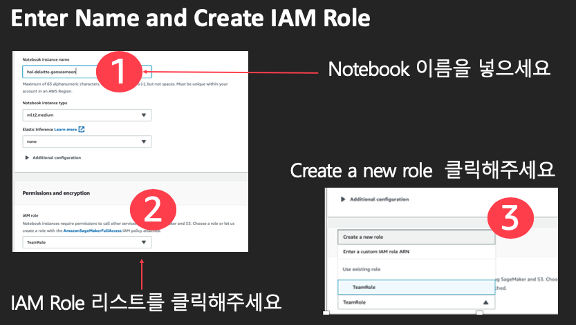

- Any S3 Bucket이 선택이 되었는지 확인 합니다. 이후에 "Create Role"을 클릭 하세요.

- "Create Notebook Instance"를 클릭 하세요.

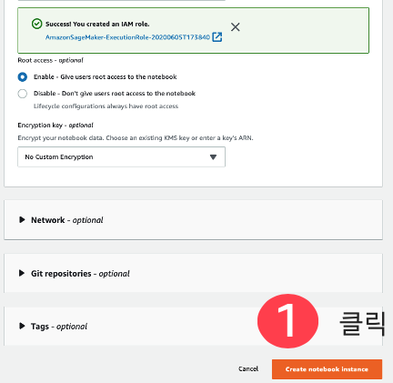

# 3. Add IAM Policy (Permission) 

- 노트북 인스턴스가 생성이 되기까지 약 5분이 걸립니다. "Status"가 InService가 가 되면, (1) Notebook Name(예: Forecast-HongGilDong)을 클릭 합니다. (2) 밑으로 내리신 다음에 Permission and encryption 의 "IAM role ARN"을 클릭 합니다. 

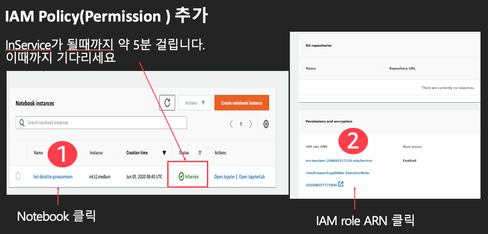

- SageMaker가 사용하는 IAM Role에 권한(Policy)을 추가 합니다.  (1) Attach Policy를 클릭하고 (2) AmazonPersonalizeFullAccess를 입력 후에 AmazonPersonalizeFullAccess를 오른쪽에 체크하고 (3) Attach Policy를 클릭 합니다.

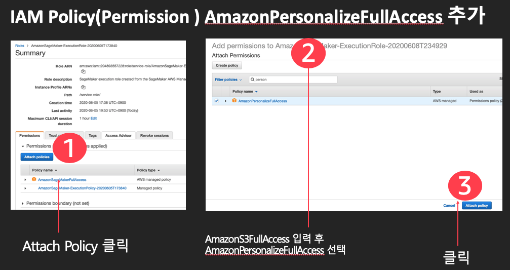

- SageMaker가 사용하는 IAM Role에 권한(Policy)을 추가 합니다.(1) Attach Policy를 클릭하고 (2) IAMFullAccess를 입력 후에 IAMFullAccess를 오른쪽에 체크하고 (3) Attach Policy를 클릭 합니다.

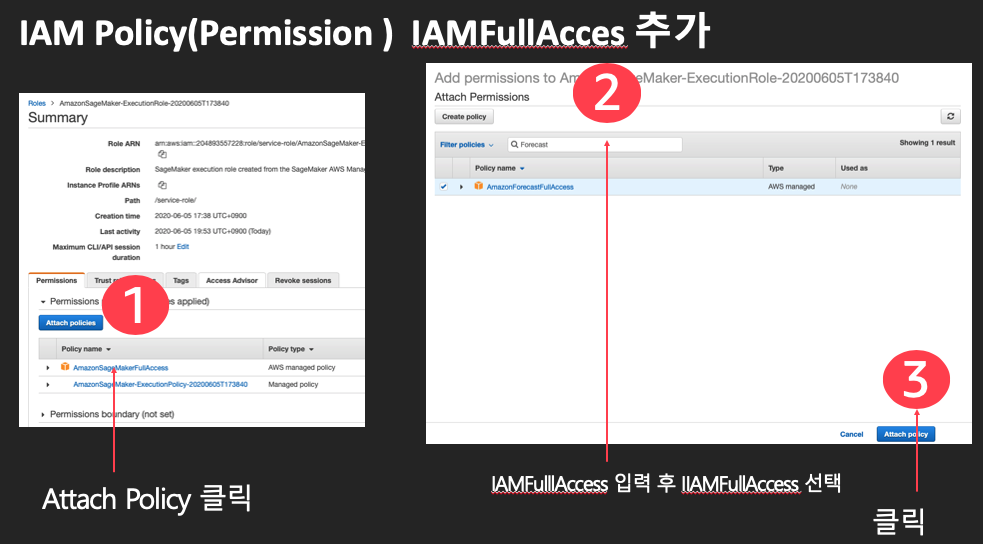

- 같은 반복으로 (1) Attach Policy를 클릭하고 (2) S3FullAccess를 입력 후에 S3FullAccess를 오른쪽에 체크하고 (3) Attach Policy를 클릭 합니다.

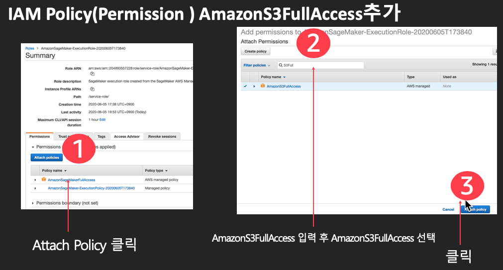

## 최종 IAM Policy 확인

- <b> (1) Show (3) More를 클릭 하고, 아래 모두 Policy가 있는지 확인 해주세요. 만일 아래 Policy가 없으시면 진행자에게 알려 주세요.Amazon Forecast를 하지 않으시면 무시 하십시오.</b>

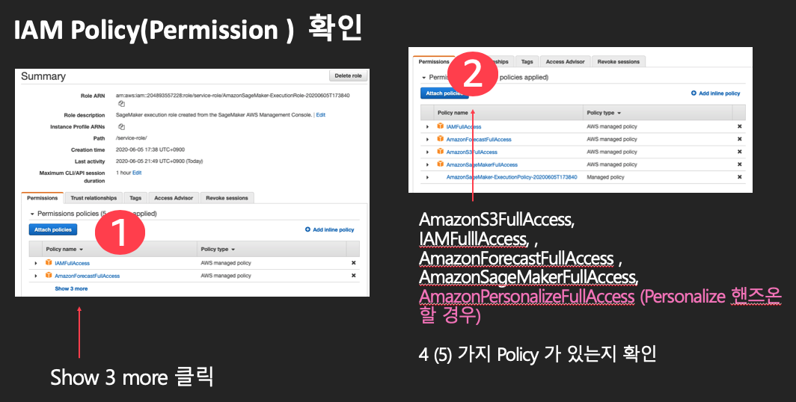

# 4. Download Git Repository

- SageMaker Notebook으로 이동 합니다.

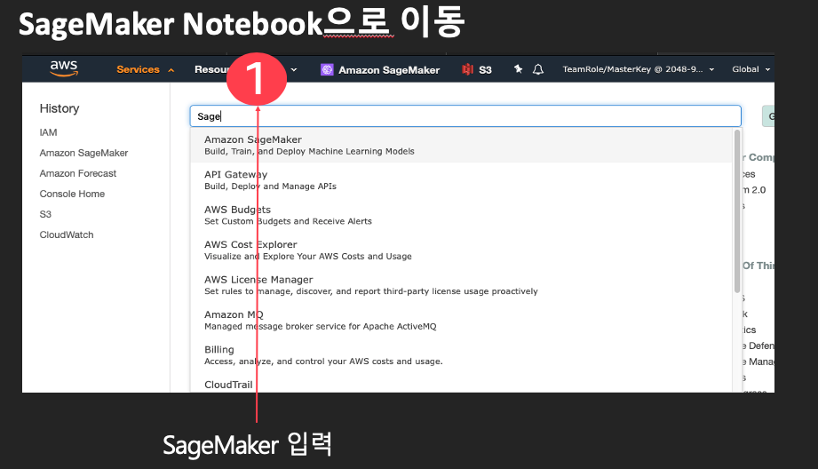

- SageMaker Notebook 인스턴스를 클릭 합니다.

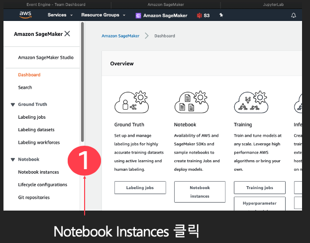

- Open Jupyter Lab을 클릭 합니다

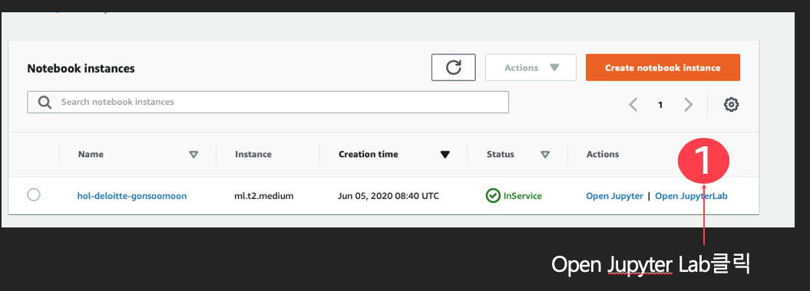

- 소스가 있는 Git Repository를 복사하기 위해서, 상단 메뉴의 Git을 클릭하고, 이어서 "Open Terminal in Git Repository"를 클릭 해주세요.

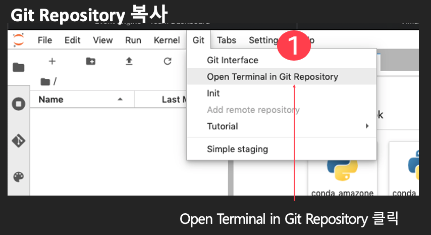

## 4-1 Git Repository 주소
    
- Hands On Lab: Amazon Personalization
    - https://github.com/gonsoomoon-ml/personalize 
    
## 4-2 Git Repository 다운로드 (Personalize 핸즈온)

- 아래 화면 처럼 입력 해주시고, 오른쪽에 폴더가 생성되었는지 확인 해주세요.
    - 간단하게 아래를 순서대로 카피 하시고 (Control-v 혹은 Cmd-v) 하시고 붙여넣기 (Control-v) 하시면 됩니다.
    - cd SageMaker
    - git clone https://github.com/gonsoomoon-ml/personalize   
    

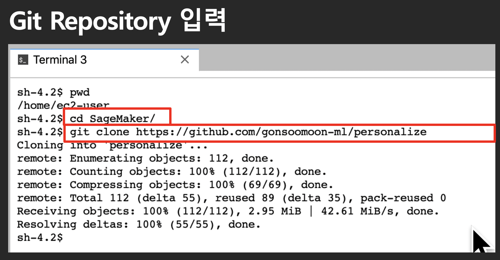

# 준비 완료 (Get Ready)

- 핸즈온의 준비가 완료 되었습니다. 만일 이 과정이 완료가 안되었으면 진행자에게 알려 주세요.
